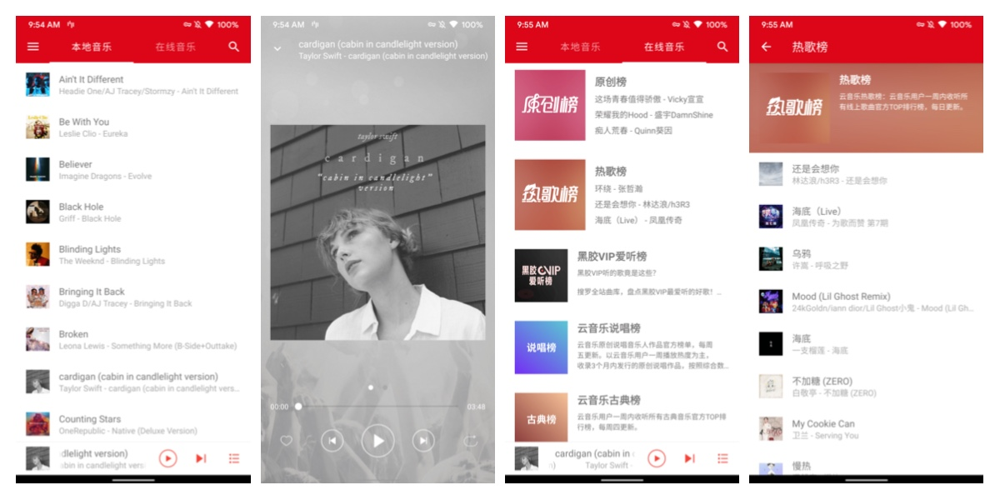

# Simple Music Player

一款界面部分仿照网易云的音乐播放器。

## 实现的功能

- 本地音乐扫描、播放（常见的音乐格式，使用 MediaPlayer 实现）
- 在线音乐获取、播放（使用网易云的音乐 API ，仅支持免费音乐）
- 通知栏控制的实现（提供了音乐信息、专辑封面，支持播放、暂停和上下曲切换）
- 接入 MediaSession （可以使用系统 API 控制音乐的播放、暂停和上下曲切换）
- 音频焦点的监听，在失去焦点后暂停播放（拔出耳机或者打开别的音乐播放器等情况）

## 效果图展示

## 感谢

> 以下这些在本项目开发的过程中提供了很多帮助

- 网易云等提供的的界面灵感
- 网易云的 API 数据
- [网易云音乐 API](https://github.com/Binaryify/NeteaseCloudMusicApi)
- [android/uamp](https://github.com/android/uamp)
- [Moriafly/DsoMusic](https://github.com/Moriafly/DsoMusic)

......

此外，本项目使用到了很多第三方的库和组件，包括但不限于 EventBus 、 OkHttp 、 RxHttp 、 Glide 等，感谢他们。

## 声明

本项目仅做学习使用，无任何商业用途，请勿修改本项目后进行任何商业用途。